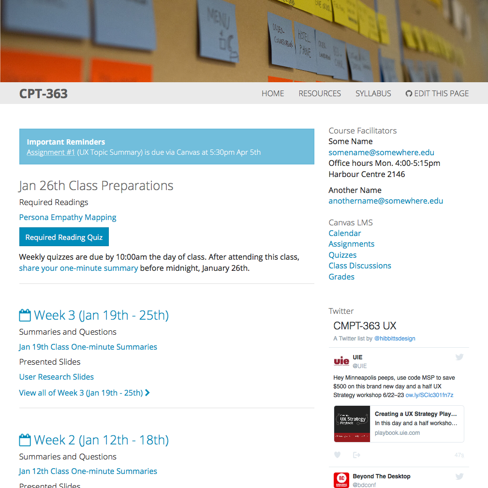

# Course Hub Grav Bootstrap Inherited Theme



**Course Hub** is a [Grav](http://getgrav.org) inherited theme based on  [Bootstrap](https://github.com/getgrav/grav-theme-bootstrap), intended to accompany a face-to-face, blended or fully online university course. It also supports a [flipped-LMS approach](http://hibbittsdesign.org/blog/posts/flipped-lms-using-an-open-and-collaborative-platform) using Grav as an open and collaborative Web platform.

# Features

* A complete ready-to-run Grav package (open source)
* Blog-format, with 'featured' (sticky) posts
* [Single course](http://hibbittsdesign.org/demo/grav-course-hub-bootstrap/) per Hub, [multiple courses](http://hibbittsdesign.org/demo/grav-multi-course-blog-hub/) per Hub or even [multiple course sub-sites](http://hibbittsdesign.org/demo/grav-multi-course-pages-hub/) (blog + multiple pages per course) per Hub
* Optional important reminders & class preparations areas
* Hub pages can be easily added/removed/changed
* Uses [Markdown](https://daringfireball.net/projects/markdown/) for streamlined cross-platform content
* Image header area above Hub navigation bar
* Sidebar is a simple markdown file, which can also contain HTML
* URL flag to only display page content (for display within LMS). For example, [http://demo.hibbittsdesign.org/grav-course-hub-bootstrap/home/week-03/onlydisplaypagecontent:true](http://demo.hibbittsdesign.org/grav-course-hub-bootstrap/home/week-03/onlydisplaypagecontent:true)
* External links are automatically opened in a new Tab/Window
* Built-in support for entire Hub to be collaboratively maintained on GitHub or GitLab (for local hosting)
* Since everything is built with Grav it can be _entirely_ customized

To learn more about how to most effectively use the Grav Course Hub, visit [hibbittdesign.org](http://hibbittsdesign.org/blog/)

# Course Hub Page Templates

* Blog template (blog.html.twig)
* Important reminders template (important_reminders.html.twig)
* Weekly preparations template (preparations.html.twig)
* Blog item template (blog_item.html.twig)
* Item template (item.html.twig)
* Page with Sidebar template (sidebarpage.html.twig)
* Full width Page template (fullwidthpage.html.twig)
* Sidebar template (sidebar.html.twig)

#Site Structure

```
/user
  - /pages
    - /01.blog | blog.html.twig and blog_item.html.twig
      -/_important-reminders | important-reminders.html.twig
      -/_preparations | class-preparations.html.twig
      -/week-01 | item.html.twig
      -/week-02 | item.html.twig
      - etc..
    - /02.resources | page.html.twig
      -/page.md
    - /03.syllabus | page.html.twig
      -/page.md
    - /sidebar | sidebar.html.twig
      -/sidebar.md
    - /headerimage | default.html.twig
      -/default.md
```

#Blog Item Page Options

In addition to standard page header options (i.e. 'Visible'), blog item pages support the following additional options:
```
icon: users           # optional font awesome icon for page title
header_image: false   # display of header image located within page folder
continue_link: false  # display entire post on blog listing page
taxonomy:
  tag: Featured       # setting to make post 'sticky' (i.e. remain at top)
```

# Installation

Installing the Course Hub theme can be done in one of three ways. The Admin Panel (plugin) lets you easily install the theme from a list of available themes, while the GPM (Grav Package Manager) installation method enables you to quickly and easily install the theme with a simple terminal command. In addition, the manual method enables you to do so via a zip file.

## Admin Panel (Preferred)

Using the Admin Panel (plugin) makes installing Course Hub a breeze. Click themes on the left menu and click Add on the top menu. Find Course Hub from the list and click on its Install button. Once complete, go back into Themes and be sure to Activate it. Finally, click on Dashboard and click the Clear Cache button on the top menu.

## GPM Installation

You can also install this theme is via the [Grav Package Manager (GPM)](http://learn.getgrav.org/advanced/grav-gpm) through your system's Terminal (also called the command line).  From the root of your Grav install type:

    bin/gpm install course-hub-bootstrap

This will install the Course Hub theme into your `/user/themes` directory within Grav. Its files can be found under `/your/site/grav/user/themes/course-hub-bootstrap`.

## Manual Installation

To install this theme, just download the zip version of this repository and unzip it under `/your/site/grav/user/themes`. Then, rename the folder to `course-hub-bootstrap`. You can find these files either on [GitHub](https://github.com/hibbitts-design/grav-theme-course-hub-bootstrap) or via [GetGrav.org](http://getgrav.org/downloads/themes).

You should now have all the theme files under

    /your/site/grav/user/themes/course-hub-bootstrap

>> NOTE: This theme is a modular component for Grav which requires the [Grav](http://github.com/getgrav/grav), [Error](https://github.com/getgrav/grav-theme-error) and [Problems](https://github.com/getgrav/grav-plugin-problems) plugins.

# Updating

As development for the Course Hub theme continues, new versions may become available that add additional features and functionality, improve compatibility with newer Grav releases, and generally provide a better user experience. Updating Course Hub is easy, and can be done through Grav's Admin Panel (plugin), as well as the GPM system and manually.

## Admin Panel (Preferred)

New updates can be picked up by the Admin Plugin. This is the quickest way and you also have access to various settings and options that are easier to access than using a file editor.

## GPM Update (Preferred)

You can update this theme is via the [Grav Package Manager (GPM)](http://learn.getgrav.org/advanced/grav-gpm). You can do this with this by navigating to the root directory of your Grav install using your system's Terminal (also called command line) and typing the following:

    bin/gpm update course-hub-bootstrap

This command will check your Grav install to see if your Course Hub theme is due for an update. If a newer release is found, you will be asked whether or not you wish to update. To continue, type `y` and hit enter. The theme will automatically update and clear Grav's cache.

## Manual Update

Manually updating the theme is pretty simple. Here is what you will need to do to get this done:

* Delete the `your/site/user/themes/course-hub-bootstrap` directory.
* Download the new version of the Course Hub theme from either [GitHub](https://github.com/hibbitts-design/grav-theme-course-hub-bootstrap) or [GetGrav.org](http://getgrav.org/downloads/themes#extras).
* Unzip the zip file in `your/site/user/themes` and rename the resulting folder to `course-hub-bootstrap`.
* Clear the Grav cache. The simplest way to do this is by going to the root Grav directory in terminal and typing `bin/grav clear-cache`.

> Note: Any changes you have made to any of the files listed under this directory will also be removed and replaced by the new set. Any files located elsewhere (for example a YAML settings file placed in `user/config/themes`) will remain intact.

# Setup

If you want to set Course Hub as the default theme, you can do so by following these steps:

* Navigate to `/your/site/grav/user/config`.
* Open the **system.yaml** file.
* Change the `theme:` setting to `theme: course-hub-bootstrap`.
* Save your changes.
* Clear the Grav cache. The simplest way to do this is by going to the root Grav directory in Terminal and typing `bin/grav clear-cache`.

Once this is done, you should be able to see the new theme on the frontend. Keep in mind any customizations made to the previous theme will not be reflected as all of the theme and templating information is now being pulled from the **course-hub-bootstrap** folder.

#Demo Content

Within the `_demo\` folder included with this theme is an example `pages` folder to copy over to your `users` folder. Be sure to keep a backup of your existing `pages` folder if you are working with an existing site.

These example pages assume that '/blog' is set in the `\config\system.yaml\` file as the 'home:alias:' value and that the 'Breadcrumbs' plugin is not enabled.
